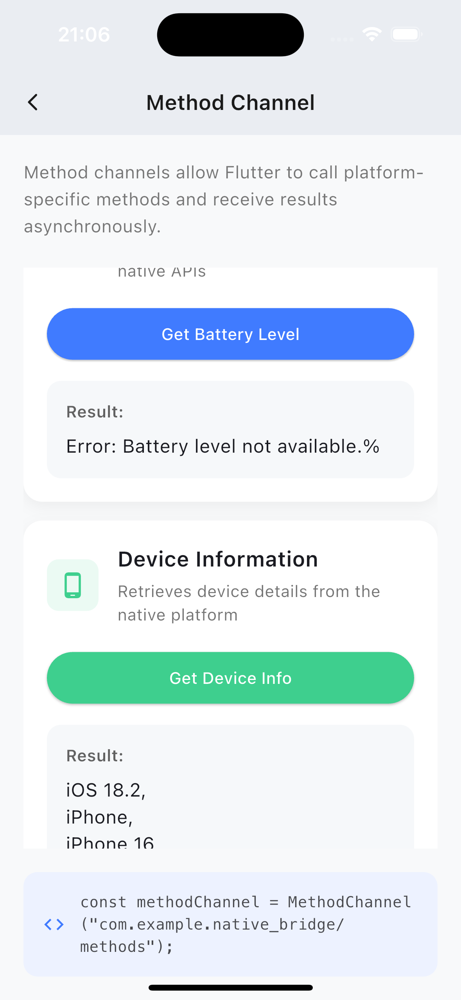

# Platform Channel - Flutter Platform Channels Showcase

A comprehensive demonstration of Flutter platform channels for seamless native code integration.

## Overview

Platform Channel is a comprehensive demonstration app showcasing Flutter's platform channel capabilities for seamless native code integration. The app implements all three types of platform channels:

- **Method Channels**: Call native methods from Flutter and receive results
- **Event Channels**: Stream continuous data from native platforms to Flutter
- **Basic Message Channels**: Simple message passing between Flutter and native code

## Features

- 🔋 Battery level monitoring using native APIs
- 📱 Device information retrieval
- 📊 Real-time sensor data streaming from native platforms
- 🔄 Two-way message communication
- 💡 Demonstration of passing complex arguments to native methods
- 🎨 Modern, beautiful UI with animations following Apple's Human Interface Guidelines

## Screenshots

### iOS

<div style="display: flex; flex-direction: row; flex-wrap: wrap; gap: 10px; justify-content: center;">
  
  
  
  
</div>

### Android

<div style="display: flex; flex-direction: row; flex-wrap: wrap; gap: 10px; justify-content: center;">
  
  
  
  
</div>

## Platform Implementations

This project contains full native implementations for both Android and iOS:

- **Android**: Native code in Kotlin
- **iOS**: Native code in Swift

## Technical Details

The app demonstrates key platform channel implementation concepts:

- Method calls with and without arguments
- Error handling in platform channels
- Stream subscription management
- Resource cleanup for event streams
- Native callback handling
- Binary message encoding/decoding
- Structured architecture for maintainable platform code

## Getting Started

### Prerequisites

- Flutter SDK (Latest stable version)
- Android Studio or Xcode
- An Android or iOS device/emulator

### Installation

1. Clone this repository:
   ```
   git clone https://github.com/osmandemiroz/platform_channels_demo.git
   ```

2. Navigate to the project folder:
   ```
   cd platform_channels_demo
   ```

3. Install dependencies:
   ```
   flutter pub get
   ```

4. Run the application:
   ```
   flutter run
   ```

## Architecture

The project follows a clean architecture approach with clear separation between UI and platform integration code:

```
lib/
├── main.dart                 # App entry point
├── screens/                  # UI screens
├── widgets/                  # Reusable UI components
├── channels/                 # Platform channel abstractions
├── models/                   # Data models
└── utils/                    # Utilities and helpers
```

Native implementations are organized in their respective platform folders:

```
android/app/src/main/kotlin/com/example/platform_channels_demo/
├── MainActivity.kt           # Platform channel setup

ios/Runner/
├── AppDelegate.swift         # Platform channel setup
```

## Channel Implementations

### Method Channel
Used to call platform-specific functions from Flutter and receive results asynchronously:
```dart
static const MethodChannel _methodChannel = MethodChannel('com.example.native_bridge/methods');
final result = await _methodChannel.invokeMethod('methodName', arguments);
```

### Event Channel
Used to receive continuous streams of data from the native platform:
```dart
static const EventChannel _eventChannel = EventChannel('com.example.native_bridge/events');
_eventChannel.receiveBroadcastStream().listen((event) { /* ... */ });
```

### Basic Message Channel
Used for simple communication between Flutter and native code:
```dart
static const BasicMessageChannel<dynamic> _messageChannel = BasicMessageChannel<dynamic>(
  'com.example.native_bridge/basic_messages',
  StandardMessageCodec(),
);
_messageChannel.send('Hello from Flutter');
```

## Learning Resources

- [Flutter Platform Channels Documentation](https://docs.flutter.dev/development/platform-integration/platform-channels)
- [In-Depth Guide to Platform Channels](https://techblog.geekyants.com/in-depth-guide-to-work-with-platform-channels-by-integrating-3rd-party-sdk-ios)
- [Flutter Plugin Development](https://docs.flutter.dev/development/packages-and-plugins/developing-packages)

## License

This project is licensed under the MIT License - see the [LICENSE](LICENSE) file for details.

## Acknowledgements

- [GeekyAnts Tech Blog](https://techblog.geekyants.com/) for their comprehensive platform channels guide
- Flutter team for the excellent platform integration capabilities
